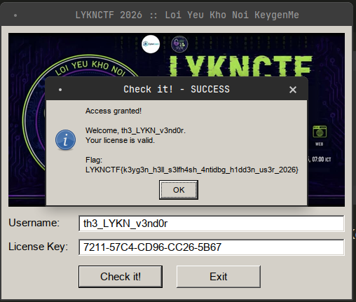
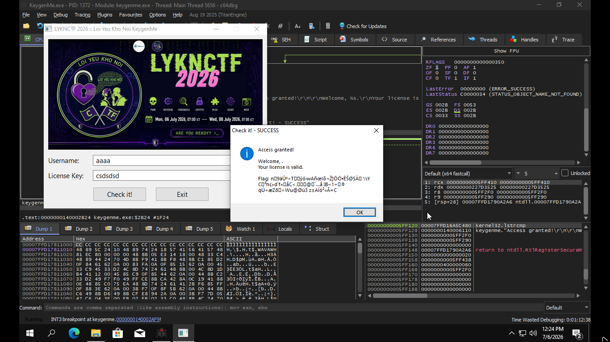
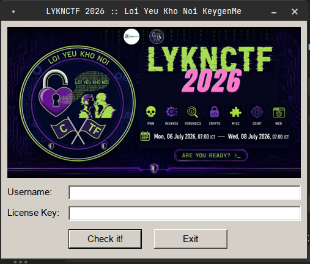
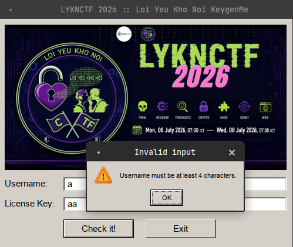
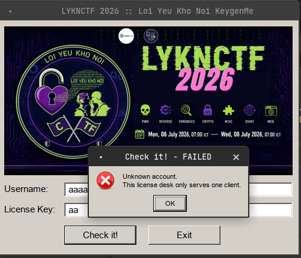
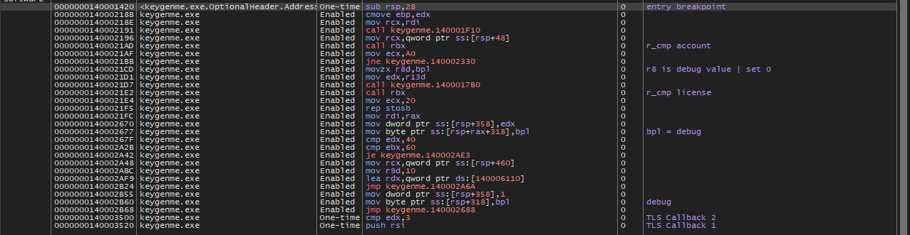
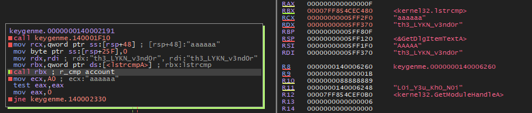
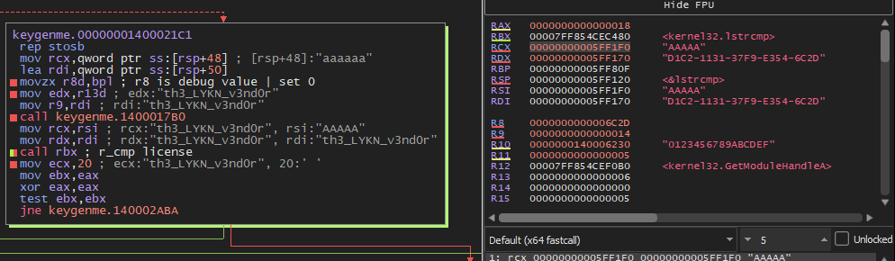
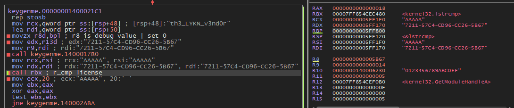

---
> Date: 10/7/2026 :beaver:     
> Owner: Khoi nguyen - Nova:dragon_face:   
> Tools reverse : Ghidra   
> Challenge:  Cr4ck 1 from LYKNCTF :   
> Target: KeygenMe.exe   
> Platform: Windows  
--- 

Summary :
- Khi chạy file `KeygenMe.exe ` thì ta thấy có 2 ô là nhập username và nhập License Key :
- Đây là 1 chương trình sinh flag khi nhập đúng tên và đúng License Key 

- Khi mà nhập đúng thì sẽ ra flag :

- Khi mà nhập không đúng mà bypass qua thì in ra flag sai như :


# Step 1:  Recon

- file `KeygenMe.exe `: 
`KeygenMe.exe: PE32+ executable (GUI) x86-64 (stripped to external PDB), for MS Windows`
- Khi chạy file ta sẽ thấy: 

- Ta nhập thử 1 vài trường hợp xem app trả về cái gì:





# Step 2:  Static Analysis:   

Lần theo strings in ra thì ra ta tìm thấy hàm xử lý input tại địa chỉ `140001fd0`   
Phân tích qua mã giả của ghidra ta thu được là:  
- App dùng GetDlgItemTextA để lấy lấy input
```c
  text_user = GetDlgItemTextA(param_1,0x3e9,local_288,0x80);
  text_license = GetDlgItemTextA(param_1,0x3ea,local_388,0x40);
```

- App kiểm tra độ dài 
```c
  if (text_user < 4) {
    MessageBoxA(param_1,"Username must be at least 4 characters.","Invalid input",0x30);
    return;
  }
```

- App kiểm tra phân tích động :
```c
  debug = *(*(unaff_GS_OFFSET + 0x60) + 2) != '\0';     # kiểm tra  BeingDebugged
  # dùng GS  ( GS là con trỏ tới TEB)  để lấy PEB (gs:[60h] ) nhằm mục đích lấy flag BeingDebugged (PEB + 2) để kiểm tra có đang debug động hay không

  if ((*(*(unaff_GS_OFFSET + 0x60) + 0xbc) & 0x70) != 0) { # kiểm tra NtGlobalFlag
    debug = debug | 2;
  }
  pHVar4 = GetModuleHandleA("ntdll.dll");
  if ((pHVar4 != 0x0) &&
     (pFVar5 = GetProcAddress(pHVar4,"NtQueryInformationProcess"), pFVar5 != 0x0)) { # Dùng NtQueryInformationProcess kiêmr tra debug 
    temp._0_4_ = 1;
    local_168 = 0;
    IVar6 = (*pFVar5)(0xffffffffffffffff,7,&local_168,8,0); # kiểm tra ProcessDebugPort
    if ((IVar6 == 0) && (local_168 != 0)) {
      debug = debug | 4;
    }
    IVar6 = (*pFVar5)(0xffffffffffffffff,0x1f,&temp,4,0); # kiểm tra ProcessDebugFlags
    if (IVar6 == 0 && temp == 0) {
      debug = debug | 8;
    }
  }
```

- App khởi tạo data account và so sánh input Username :
  
```c
  Mã giả 
  de_data(&temp);
  local_1f9 = 0;
  r_cmp = lstrcmpA(local_288,&temp);
  i = 0xa0;
  puVar9 = &temp;
  if (r_cmp != 0) {
    for (; i != 0; i = i + -1) {
      *puVar9 = 0;
      puVar9 = puVar9 + 1;
    }
    MessageBoxA(param_1,"Unknown account.\r\nThis license desk only serves one client.",
                "Check it! - FAILED",0x10);
    return;
  }
```
=> So sánh với data có sẵn và nếu sai trả về Unknown account
```c
  code assembly 
14000218e 48 89 f9        MOV        param_1,RDI
140002191 e8 7a fd        CALL       de_data                                        
        ff ff
140002196 48 8b 4c        MOV        param_1,qword ptr [RSP + local_410]
        24 48
14000219b c6 84 24        MOV        byte ptr [RSP + local_1f9],0x0
        5f 02 00 
        00 00
1400021a3 48 89 fa        MOV        RDX,RDI
1400021a6 48 8b 1d        MOV        RBX,qword ptr [->KERNEL32.DLL::lstrcmpA]         = 0000b82a 
        e3 92 00 00
1400021ad ff d3           CALL       RBX=>KERNEL32.DLL::lstrcmpA # đặt breakpoint ở đây và xem tham số so sánh là gì 

```
=>  chúng ta có thể đặt breakpoint ở đoạn so sánh để lấy user 

- App khởi tạo license và so sánh với input license:
```c
  Mã giả 
 initial_license(local_288,text_user,debug,local_408); $ nhận user name, debug làm tham số
  r_cmp = lstrcmpA(local_388,local_408);
  i = 0x20;
  pCVar14 = local_408;
  if (r_cmp != 0) {
    for (; i != 0; i = i + -1) {
      *pCVar14 = '\0';
      pCVar14 = pCVar14 + 1;
    }
    MessageBoxA(param_1,"Wrong license key for this account.\r\nKeep reversing!",
                "Check it! - FAILED",0x10);
    return;
  }
```
```c
  code assembly 
1400021c8 48 8d 7c        LEA        RDI=>local_408,[RSP + 0x50]
          24 50
1400021cd 44 0f b6 c5     MOVZX      R8D,BPL # debug là tham số thứ 3 nên sẽ là r8 
1400021d1 44 89 ea        MOV        EDX,R13D
1400021d4 49 89 f9        MOV        R9,RDI
1400021d7 e8 d4 f5        CALL       initial_license                                 
          ff ff
1400021dc 48 89 f1        MOV        i,RSI
1400021df 48 89 fa        MOV        RDX,RDI
1400021e2 ff d3           CALL       RBX=>KERNEL32.DLL::lstrcmpA # ta có thể đặt breakpoint ở đây để xem 
```
=> Hàm initial_license nhận user name, debug làm tham số nên ta cần bypass debug để được giá trị đúng 

- App app kiểm tra và in flag 
```c
  if ((uVar10 == 0x60) ||
     (CONCAT44(auStack_3a4[0],CONCAT13(uStack_3a5,CONCAT21(uStack_3a7,local_3a8))) !=
      0x2679dda8691cb57d)) {
    MessageBoxA(param_1,"License valid, but the vault stays locked.\r\n(are you being watched?)",
                "Check it! - FAILED",0x10);
  }
  else {
    *(local_2e8 + uVar10) = 0;
    wsprintfA(&local_168,
              "Access granted!\r\n\r\nWelcome, %s.\r\nYour license is valid.\r\n\r\nFlag: %s",
              local_288,local_2e8);
    MessageBoxA(param_1,&local_168,"Check it! - SUCCESS",0x40);
```

# Step 3:  Dynamic Analysis:   

- Ta sẽ dùng x64dbg để phân tích động và Base Image address của app là 140000000
- Breakpoint của mình dùng là :

- Ta sẽ nhập một username và license key  bất kì ví dụ trong trường hợp này thì mình chọn username là `aaaaaa` và license key là `aaaaa`
- Ta sẽ đặt Breakpoint tại các lúc gọi hàm  so sánh và kiểm tra các tham số truyền vào  
- Breakpoint tại lúc gọi hàm so sánh account:

Theo quy ước gọi hàm của  Windows 64-bit (Microsoft x64 calling convention ) thì ta có:   
tham số 1 là RCX, tham số 2 là RDX, tham số 3 là R8, và tham số 4 R9.  
vậy ta có :   
`RCX = "aaaaaa"` = input 
`RDX = "th3_LYKN_v3nd0r"` = user được khởi tạo 
=> user input cần tìm là `th3_LYKN_v3nd0r`

- Breakpoint tại lúc gọi hàm so sánh license :
Nếu ta không để ý chỉnh sửa giá trị debug thì sẽ ra license giả:

=> Vậy để có thể sửa giá trị debug thì thì ta chỉ cần sửa 1 byte cuối của thanh ghi rbp thành 0 
Để có thể ra đúng license ta cần debug lại với username là `th3_LYKN_v3nd0r` và sửa lại giá trị rbp tại `1400021CD`

`RDX = "7211-57C4-CD96-CC26-5B67"`  = lincense đúng 
- Và ta chỉ cần nhập username là  `th3_LYKN_v3nd0r` và lincense là `7211-57C4-CD96-CC26-5B67` là ra flag 

