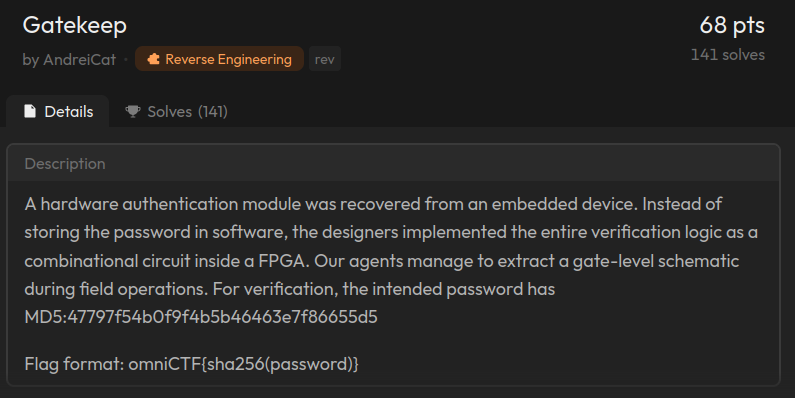
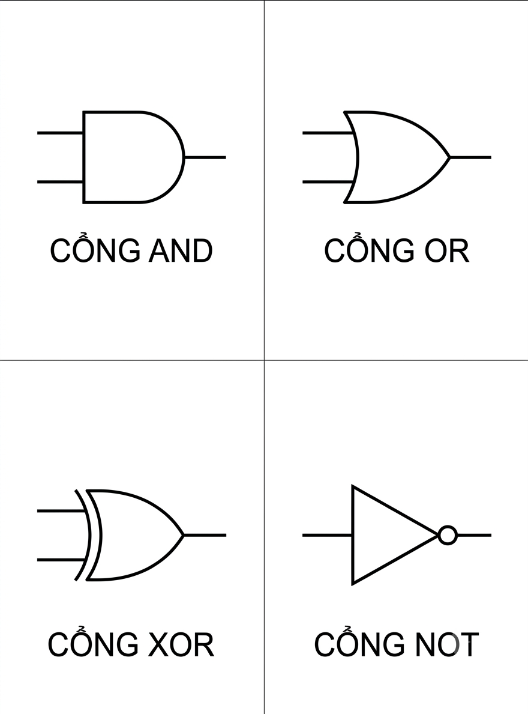
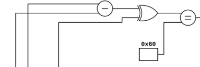

---
> Date: 20/7/2026 :beaver:     
> Owner: Khoi nguyen - Nova:dragon_face:   
> Challenge:  Gatekeep from OmniCTF 2026 :   
--- 

# Summary 

Challenge details :  



Mạch mà ta cần khôi phục lại :  
 


=> đề bài cho ta hash của mật khẩu là `MD5:47797f54b0f9f4b5b46463e7f86655d5` nên ta chỉ cần khôi phục lại mạch là ta có thể brute force ra được mật khẩu 

# Recon 

Dựa theo sơ đồ trên thì ta thu được các cổng logic là :  



# Analysis 

Ta nhìn vào hình thì thấy kết quả valid là kết quả của cách phép toán so sánh nhỏ and với nhau  

ta lấy ví dụ là phép toán đầu tiên  :  



=> truy ngược là từ các cổng thì ra thu được là `((c1 - c4 ) ^ (c1 + c4) ) == 0x60`

Làm tương tự thì ta sẽ thu được các phép toán tiếp theo :  
```c
    (( (c1 + c3 ) + c2) | ( ( c1 & c2 ) & (c1 + c4)) ) == 0x45 
    (( (c9 ^ c6 ) - ( c8 &  c6) ) + (c9 - (~(c1 &c2) ) )) == 0xaf 
    ((c7 & ~c4) ^ (c1 + c5 ) ) == 0xbb 
    (c9 + c5) == 0xa5  
    ( c9 ^ c5 ) == 0x41  
    (((c6 & c5 ) ^ (c9 | c5 ) ) ^ ( ~c5 & ~c6)) == 0xb2 
    (( c1 + c5) -  c9 ) == 0x87  
    ( ((c4 & c5 ) & c9 )  | ( ( (c1 & c8) & c2 ) ^ (c2 + c8) )) == 0xfd 
```

Sau khi có được các phép toán thì ta sẽ dùng thư viện `z3`  để tự động tìm nghiệm có hash đúng với đề cho 

```c
from z3 import *
import hashlib

s = Solver()

c1 = BitVec('c1', 8)
c2 = BitVec('c2', 8)
c3 = BitVec('c3', 8)
c4 = BitVec('c4', 8)
c5 = BitVec('c5', 8)
c6 = BitVec('c6', 8)
c7 = BitVec('c7', 8)
c8 = BitVec('c8', 8)
c9 = BitVec('c9', 8)
 
 
s.add(((c1 - c4 ) ^ (c1 + c4) ) == 0x60 )
s.add ( (( (c1 + c3 ) + c2) | ( ( c1 & c2 ) & (c1 + c4)) ) == 0x45 )
s.add ( (( (c9 ^ c6 ) - ( c8 &  c6) ) + (c9 - (~(c1 &c2) ) )) == 0xaf )
s.add (((c7 & ~c4) ^ (c1 + c5 ) ) == 0xbb )
s.add( (c9 + c5) == 0xa5  )
s.add (( c9 ^ c5 ) == 0x41  )
s.add((((c6 & c5 ) ^ (c9 | c5 ) ) ^ ( ~c5 & ~c6)) == 0xb2 )
s.add((( c1 + c5) -  c9 ) == 0x87  )
s.add(( ((c4 & c5 ) & c9 )  | ( ( (c1 & c8) & c2 ) ^ (c2 + c8) )) == 0xfd )

while s.check() == sat:
    m = s.model()
    vals = [m[v].as_long() for v in (c1,c2,c3,c4,c5,c6,c7,c8,c9)]
    h = hashlib.md5(bytes(vals)).hexdigest()
    if h == "47797f54b0f9f4b5b46463e7f86655d5":
        print(f"pass {bytes(vals).decode()}")
        break
   
    s.add(Or([v != m[v] for v in (c1,c2,c3,c4,c5,c6,c7,c8,c9)]))
```
=> chạy ta thu được pass `HWf0rL1f3`

`HWf0rL1f3` 
MD5 Hash = `47797f54b0f9f4b5b46463e7f86655d5` 
SHA256 Hash = `286fc732ff998a04c5660b517df3404b4de58292ae0b3002fd107ecb484f8d70`

=> flag là `omniCTF{286fc732ff998a04c5660b517df3404b4de58292ae0b3002fd107ecb484f8d70}`